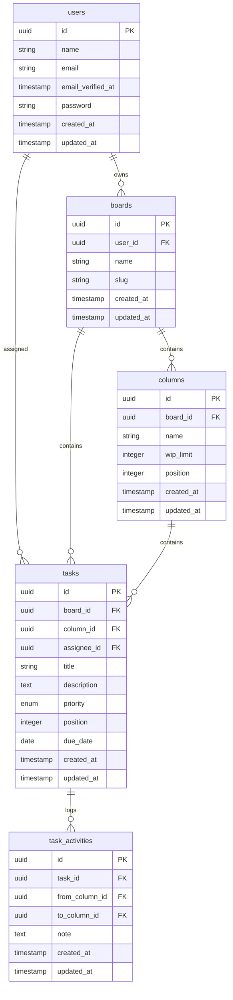

# Task Hive - Full-Stack Kanban Web Application


A modern, full-stack Kanban task management application built with Laravel 11, Livewire 3, Alpine.js, and Tailwind CSS. Features real-time drag-and-drop functionality, user authentication, and a responsive design.

## 🚀 Features

### Backend (Laravel 11 + PostgreSQL)
- **🔐 Authentication**: Laravel Breeze with Blade templates
- **🆔 UUID Support**: All models use UUIDs as primary keys
- **🗄️ PostgreSQL Database**: Production-ready database with optimized queries
- **🛡️ Authorization Policies**: Users can only manage their own boards/tasks
- **🔌 RESTful API**: Complete CRUD operations for boards, columns, and tasks
- **📊 Activity Logging**: Track task movements between columns
- **⚡ Performance**: Database indexes and eager loading optimizations

### Frontend (Livewire + Alpine.js + Tailwind CSS)
- **🎨 Modern UI**: Beautiful, responsive design with Tailwind CSS
- **🔄 Real-time Updates**: Livewire for seamless server-side interactions
- **📱 Mobile-First**: Responsive design that works on all devices
- **🎯 Drag & Drop**: Smooth task movement between columns with Alpine.js
- **⚡ Fast Loading**: Optimized assets with Vite bundling
- **🎭 Interactive Modals**: Create and edit tasks with smooth animations

### Task Management
- **📋 Task Creation**: Rich task forms with priority, assignee, and due dates
- **🏷️ Priority Levels**: Low, Medium, High priority with visual indicators
- **👥 User Assignment**: Assign tasks to team members
- **📅 Due Dates**: Track task deadlines with date picker
- **📝 Descriptions**: Rich text descriptions for detailed task information
- **🔄 Column Management**: Customizable columns with WIP limits

## 🏗️ Architecture

### Database Schema



## 🛠️ Tech Stack

### Backend
- **Framework**: Laravel 11.x
- **Database**: PostgreSQL 12+
- **Authentication**: Laravel Breeze
- **API**: RESTful with Sanctum
- **Validation**: Form Request classes
- **Testing**: PHPUnit

### Frontend
- **Framework**: Laravel Livewire 3.x
- **JavaScript**: Alpine.js 3.x
- **CSS**: Tailwind CSS 3.x
- **Build Tool**: Vite
- **Icons**: Heroicons

### Development Tools
- **Package Manager**: Composer (PHP), NPM (Node.js)
- **Version Control**: Git
- **Code Style**: Laravel Pint
- **Environment**: Docker (optional)

## 📦 Installation

### Prerequisites

- **PHP**: 8.2 or higher
- **Composer**: Latest version
- **PostgreSQL**: 12 or higher
- **Node.js**: 18 or higher
- **NPM**: 8 or higher

### Quick Start

1. **Clone the repository**
   ```bash
   git clone https://github.com/yourusername/task-hive.git
   cd task-hive
   ```

2. **Install PHP dependencies**
   ```bash
   composer install
   ```

3. **Install Node.js dependencies**
   ```bash
   npm install
   ```

4. **Environment setup**
   ```bash
   cp .env.example .env
   php artisan key:generate
   ```

5. **Database configuration**
   ```bash
   # Update .env with your PostgreSQL credentials
   DB_CONNECTION=pgsql
   DB_HOST=127.0.0.1
   DB_PORT=5432
   DB_DATABASE=task_hive
   DB_USERNAME=postgres
   DB_PASSWORD=your_password
   ```

6. **Run migrations and seeders**
   ```bash
   php artisan migrate
   php artisan db:seed
   ```

7. **Build frontend assets**
   ```bash
   npm run build
   ```

8. **Start the development server**
   ```bash
   php artisan serve
   ```

9. **Access the application**
   - Open your browser to `http://localhost:8000`
   - Login with demo credentials:
     - **Email**: `demo@taskhive.com`
     - **Password**: `password`

## 🎯 Usage

### Getting Started

1. **Login** with your credentials
2. **View Dashboard** to see your boards and task statistics
3. **Create a Board** or select an existing one
4. **Add Tasks** by clicking the "+" button in any column
5. **Drag & Drop** tasks between columns to update their status
6. **Edit Tasks** by clicking on them to open the modal

### Demo Data

The application comes with pre-seeded demo data:
- **3 Demo Users** with different email addresses
- **3 Sample Boards** with different purposes
- **12 Columns** across all boards
- **12 Sample Tasks** in various stages

## 🔌 API Endpoints

### Authentication Required
All API endpoints require authentication via Laravel Sanctum or session-based auth.

### Boards
| Method | Endpoint | Description |
|--------|----------|-------------|
| `GET` | `/api/boards` | List user's boards |
| `POST` | `/api/boards` | Create new board |
| `GET` | `/api/boards/{board}` | Show board details |
| `PATCH` | `/api/boards/{board}` | Update board |
| `DELETE` | `/api/boards/{board}` | Delete board |

### Columns
| Method | Endpoint | Description |
|--------|----------|-------------|
| `POST` | `/api/boards/{board}/columns` | Create column |
| `PATCH` | `/api/boards/{board}/columns/{column}` | Update column |
| `DELETE` | `/api/boards/{board}/columns/{column}` | Delete column |
| `PATCH` | `/api/boards/{board}/columns/positions` | Update column order |

### Tasks
| Method | Endpoint | Description |
|--------|----------|-------------|
| `POST` | `/api/boards/{board}/tasks` | Create task |
| `GET` | `/api/boards/{board}/tasks/{task}` | Show task details |
| `PATCH` | `/api/boards/{board}/tasks/{task}` | Update task |
| `DELETE` | `/api/boards/{board}/tasks/{task}` | Delete task |
| `PATCH` | `/api/boards/{board}/tasks/{task}/move` | Move task between columns |
| `PATCH` | `/api/boards/{board}/columns/{column}/tasks/positions` | Update task order |

## 🧪 Development

### Running Tests
```bash
php artisan test
```

### Code Style
```bash
./vendor/bin/pint
```

### Frontend Development
```bash
npm run dev
```

### Database Reset
```bash
php artisan migrate:fresh --seed
```

### Clear Caches
```bash
php artisan cache:clear
php artisan config:clear
php artisan route:clear
php artisan view:clear
```

## 🚀 Production Deployment

### Environment Setup
1. Set `APP_ENV=production` in `.env`
2. Set `APP_DEBUG=false` in `.env`
3. Configure proper database credentials
4. Set up queue workers for background jobs

### Web Server Configuration
- **Nginx** or **Apache** configuration
- **SSL certificates** setup
- **Static asset** serving optimization

### Performance Optimizations
- **Database indexes** on frequently queried columns
- **Eager loading** to prevent N+1 queries
- **Composite indexes** for complex queries
- **Asset optimization** with Vite production build

## 🔒 Security Features

- **CSRF Protection** on all forms
- **SQL Injection Prevention** via Eloquent ORM
- **XSS Protection** with output escaping
- **Authorization Policies** for data access
- **Rate Limiting** on API endpoints
- **Password Hashing** with bcrypt
- **UUID Primary Keys** for security

## 📊 Performance

- **Database Indexes** on frequently queried columns
- **Eager Loading** to prevent N+1 queries
- **Composite Indexes** for complex queries
- **UUID Primary Keys** for distributed systems
- **Efficient Foreign Key** relationships
- **Optimized Queries** with proper joins

## 🤝 Contributing

1. Fork the repository
2. Create a feature branch (`git checkout -b feature/amazing-feature`)
3. Commit your changes (`git commit -m 'Add some amazing feature'`)
4. Push to the branch (`git push origin feature/amazing-feature`)
5. Open a Pull Request

## 📝 License

This project is open-sourced software licensed under the [MIT license](https://opensource.org/licenses/MIT).

## 🙏 Acknowledgments

- [Laravel](https://laravel.com/) - The PHP framework
- [Livewire](https://livewire.laravel.com/) - Full-stack framework
- [Alpine.js](https://alpinejs.dev/) - Lightweight JavaScript framework
- [Tailwind CSS](https://tailwindcss.com/) - Utility-first CSS framework
- [PostgreSQL](https://www.postgresql.org/) - The database
- [Vite](https://vitejs.dev/) - Build tool

## 📞 Support

If you have any questions or need help, please:
- Open an issue on GitHub
- Check the documentation
- Review the code examples

---

**Made with ❤️ using Laravel, Livewire, Alpine.js, and Tailwind CSS**